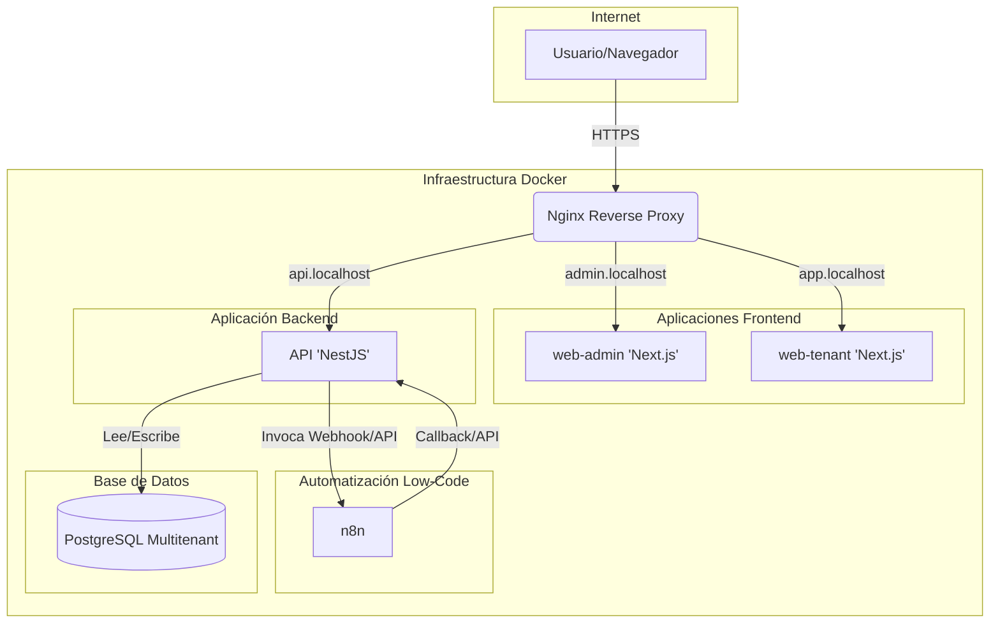

# Arquitectura del Proyecto

Este documento describe la arquitectura de alto nivel de **Auto-Vendi**, mostrando cómo los diferentes servicios interactúan entre sí para ofrecer una plataforma SaaS B2B de automatización de procesos comerciales.

## Diagrama de Arquitectura

El siguiente diagrama ilustra el flujo de peticiones a través del sistema. Nginx actúa como un proxy inverso que dirige el tráfico al servicio correspondiente basándose en el hostname. La API central orquesta la lógica de negocio e invoca flujos de trabajo en n8n.

## Descripción de Servicios

### 1. **Nginx (Reverse Proxy)**
-   **Responsabilidad:** Es el punto de entrada único para todo el tráfico. Se encarga de recibir las peticiones y redirigirlas al servicio correcto basándose en el `server_name` (ej: `admin.localhost`). También gestiona los certificados SSL en producción.

### 2. **web-admin (`admin.localhost`)**
-   **Tecnología:** Next.js 14 (App Router), TailwindCSS, ShadCN UI.
-   **Responsabilidad:** Panel administrativo para la gestión de cuentas de empresas (tenants) y la configuración general del sistema. Es el centro de control de la plataforma.

### 3. **web-tenant (`app.localhost`)**
-   **Tecnología:** Next.js 14 (App Router), TailwindCSS, ShadCN UI.
-   **Responsabilidad:** Panel de empresa (tenant) donde cada cliente maneja sus catálogos de productos, clientes, y configura sus flujos de cotización.

### 4. **api (`api.localhost`)**
-   **Tecnología:** NestJS 10, TypeScript, TypeORM.
-   **Responsabilidad:** Es el cerebro de la aplicación. Contiene la lógica de negocio, gestiona la autenticación, la autorización y la comunicación con la base de datos. Expone una API REST para ser consumida por los frontends y servicios externos.

### 5. **database**
-   **Tecnología:** PostgreSQL (multi-schema).
-   **Responsabilidad:** Almacena de forma persistente todos los datos de la aplicación. Utiliza una estrategia de **schema-per-tenant** para garantizar un aislamiento estricto de los datos de cada empresa.

### 6. **n8n**
-   **Tecnología:** n8n (low-code orchestration).
-   **Responsabilidad:** Actúa como motor de automatización para flujos de trabajo internos y externos. Es invocado por la API para orquestar tareas como el envío de cotizaciones por WhatsApp, notificaciones, o la integración con APIs de terceros como OpenAI.

### 5. **database**
-   **Tecnología:** PostgreSQL
-   **Responsabilidad:** Almacena de forma persistente todos los datos de la aplicación, como usuarios, productos, configuraciones, etc.
