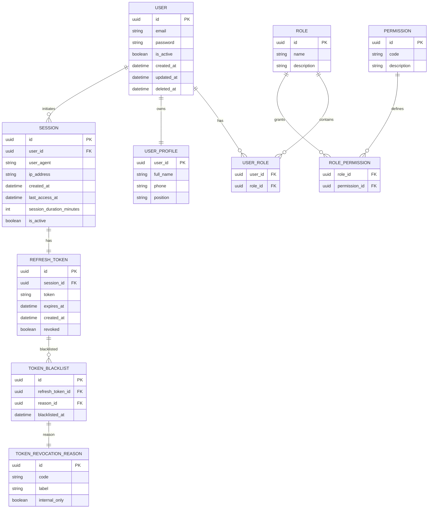
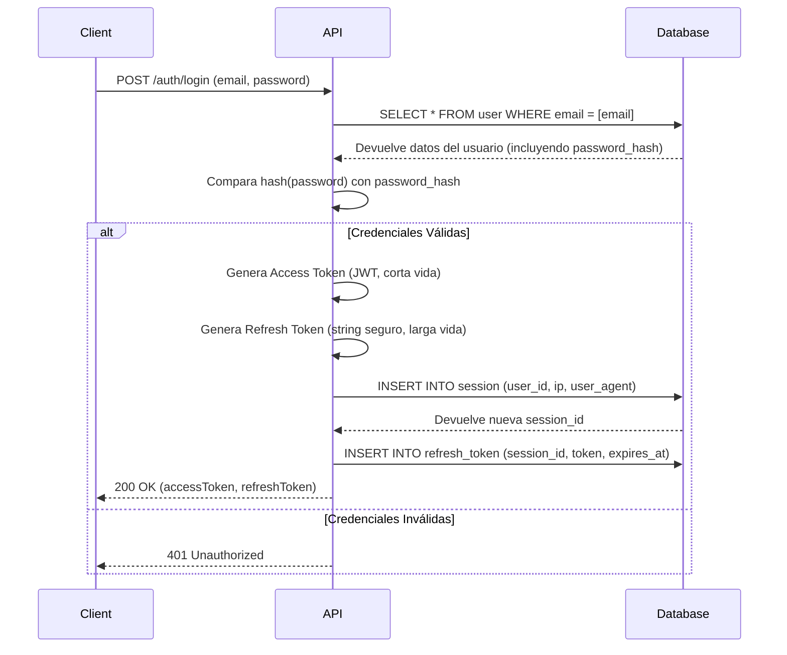
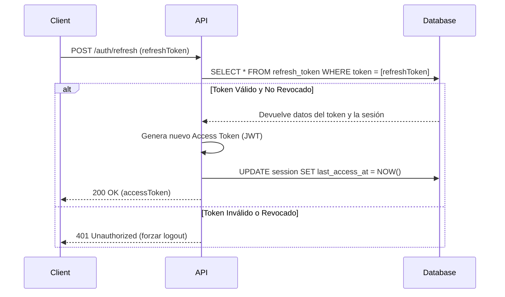

# Arquitectura de Autenticación y Autorización

Este documento detalla el diseño de la base de datos y los flujos de información para el módulo de autenticación (AuthN) y autorización (AuthZ) del boilerplate. El objetivo es crear un sistema seguro, escalable y flexible que sirva como base para cualquier aplicación SaaS.

## 1. Diagrama de Entidad-Relación (ERD)

El siguiente diagrama muestra la estructura completa de las tablas relacionadas con la gestión de usuarios, roles, permisos, sesiones y API keys.

## 2. Análisis Detallado del Esquema

### Tablas de Identidad y Roles (RBAC)

-   **USER**: Es la entidad central. Almacena las credenciales de inicio de sesión.
    -   *Relación TypeORM*: `OneToOne` con `USER_PROFILE`, `OneToMany` con `SESSION`, `ManyToMany` con `ROLE`.
-   **USER_PROFILE**: Contiene información personal no sensible, separada de las credenciales para mayor seguridad y organización.
    -   *Relación TypeORM*: `OneToOne` con `USER`.
-   **ROLE**: Define un conjunto de responsabilidades (ej. "Administrador", "Editor").
    -   *Relación TypeORM*: `ManyToMany` con `USER` y `PERMISSION`.
-   **PERMISSION**: Representa una acción atómica y específica que un usuario puede realizar (ej. `create:invoice`, `read:user`).
    -   *Relación TypeORM*: `ManyToMany` con `ROLE`.
-   **USER_ROLE** y **ROLE_PERMISSION**: Son las tablas de unión (join tables) para implementar las relaciones `ManyToMany` del sistema de Role-Based Access Control (RBAC).

### Tablas de Sesión y Tokens

-   **SESSION**: Registra cada inicio de sesión de un usuario desde un dispositivo/navegador específico. Permite al usuario ver y cerrar sesiones activas en otros dispositivos.
    -   *Relación TypeORM*: `ManyToOne` con `USER`, `OneToOne` con `REFRESH_TOKEN`.
-   **REFRESH_TOKEN**: Almacena el token de refresco, que es una credencial de larga duración usada para obtener nuevos `access tokens` sin que el usuario tenga que volver a escribir su contraseña.
    -   *Relación TypeORM*: `OneToOne` con `SESSION`.
-   **TOKEN_BLACKLIST** y **TOKEN_REVOCATION_REASON**: Un mecanismo de seguridad crucial. Permite invalidar tokens de refresco de forma explícita (ej. al cerrar sesión, cambiar contraseña) y registrar por qué se hizo.

## 3. Flujo de Inicio de Sesión (Login)

Este diagrama de secuencia muestra cómo interactúan los componentes del sistema cuando un usuario inicia sesión.

## 4. Flujo de Refresco de Token

Cuando el `access token` expira, el cliente utiliza el `refresh token` para obtener uno nuevo sin interrumpir al usuario.

